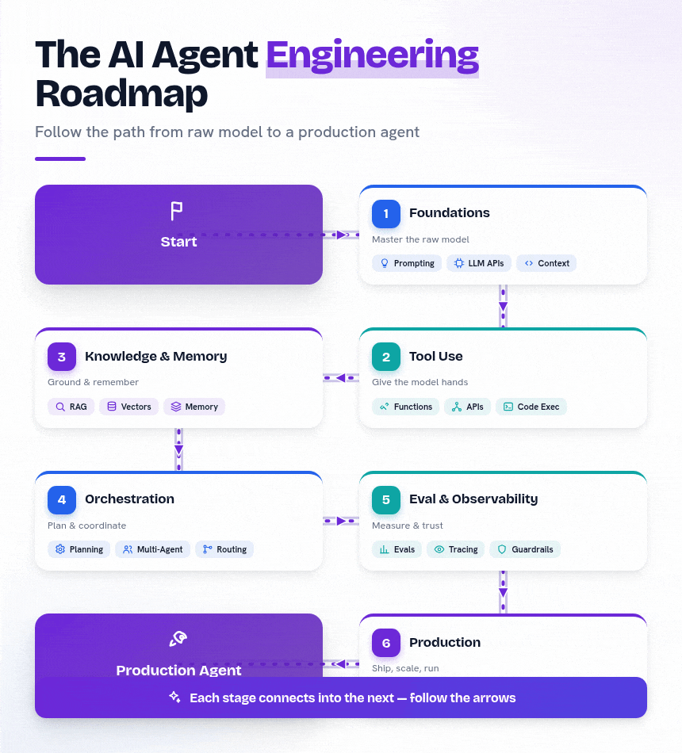
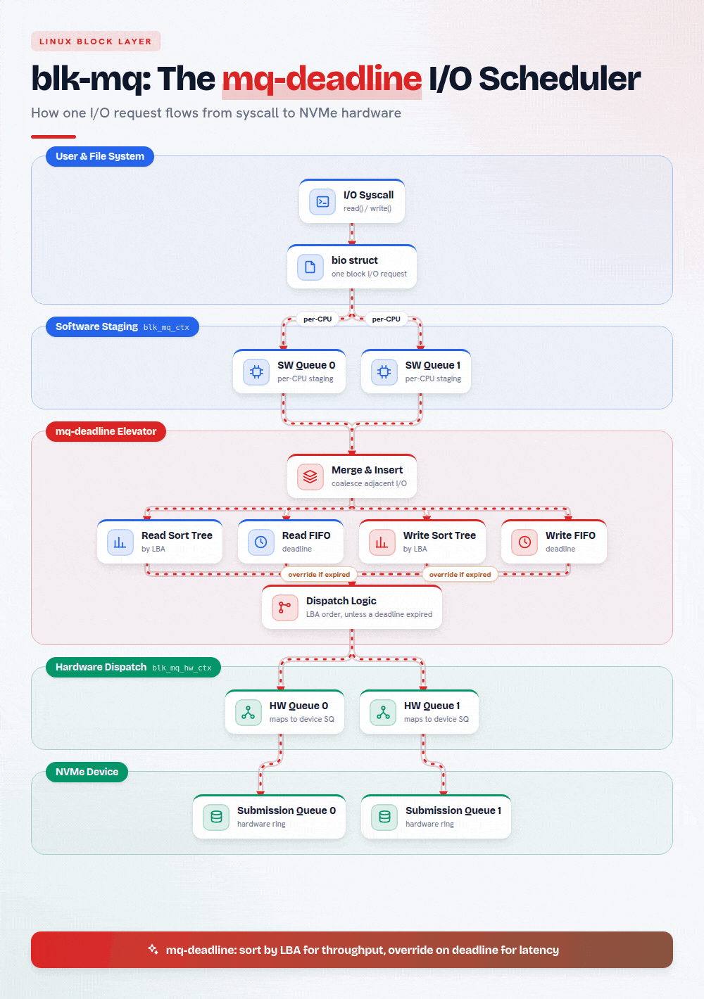
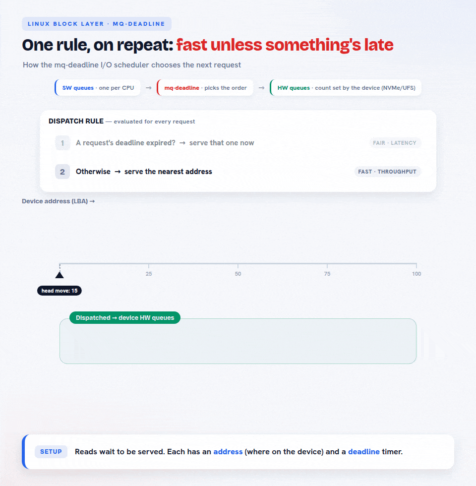
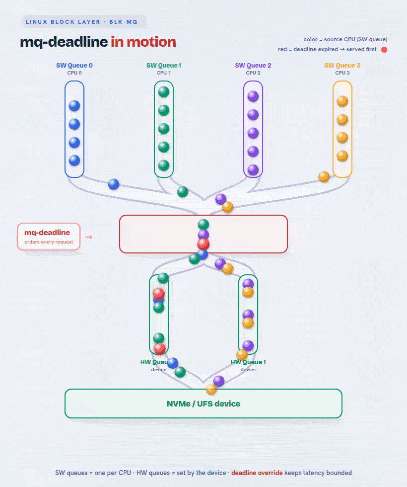
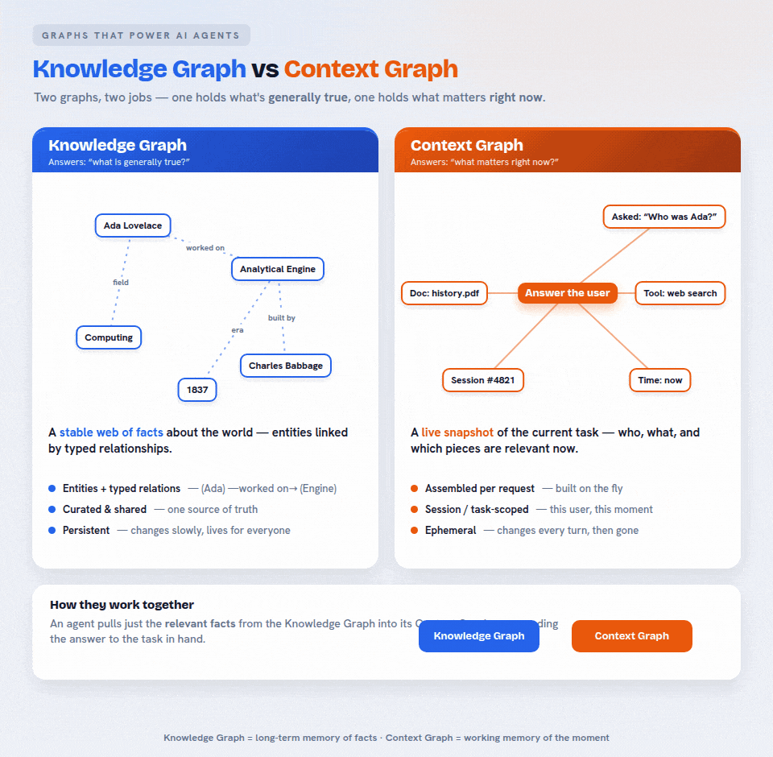

# ai_skills

Claude Code skills.

## animated-infographic

Turn a topic + content into a polished **animated GIF / APNG** or **static PNG / JPEG**
infographic. Templates: `flow`, `ladder`, `comparison`, `roadmap`, `dataflow`, `poster` —
plus a `--raw-html` mode for bespoke scripted explainer / simulation animations.

Renders from code via headless Chromium, with FFmpeg two-pass palette + gifsicle encoding
(≈10–15× smaller GIFs). No AI image model required.

- Setup & usage: [`skills/animated-infographic/README.md`](skills/animated-infographic/README.md)
- Full spec / template reference: [`skills/animated-infographic/SKILL.md`](skills/animated-infographic/SKILL.md)

### Quick start
```bash
cd skills/animated-infographic
npm install          # see README for the Chromium note on boxes without `unzip`
node render.mjs examples/sample-spec.json --out ./out
```

### Gallery

Sample outputs from the skill (see [`skills/animated-infographic/gallery/`](skills/animated-infographic/gallery/)):

| Preview | Made with |
|---|---|
|  | `roadmap` template — connected serpentine journey |
|  | `dataflow` template — zoned top-down diagram (Linux blk-mq) |
|  | `--raw-html` explainer — the mq-deadline decision rule |
|  | `--raw-html` simulation — I/O requests as marbles through the queues |
|  | `--raw-html` comparison — Knowledge Graph vs Context Graph |
